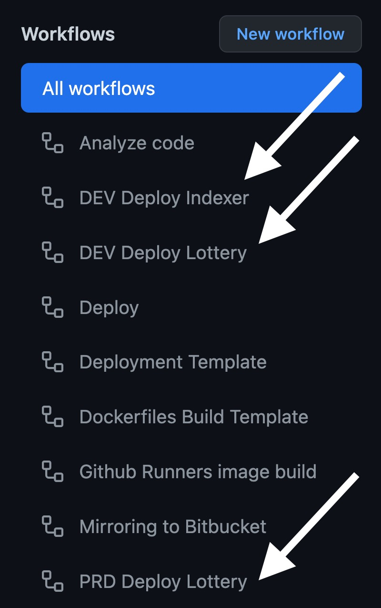

# Deployment
This document is describing the deployment process, how it's triggered and how it works

## Workflow

Github Repo uses [github actions](https://github.com/features/actions) to run the deployment pipeline.

## Deployment List
The [deployment pipelines](https://github.com/mlabs-haskell/nezha/blob/main/.github/workflows/deploy-template.yaml) are triggered manually by going to **Actions -> All Workflow**

## Run Deployment
When you trigger a deployment pipeline it will build and create the latest image and if it succeeds it will trigger the deployment pipeline for the required environment.
In order to run your deployment go to
**Actions -> All Workflow -> Dev Deploy Lottery** (or any other as you need) and then **Run workflow** in the right top corner

The github will set the image tag, using the hash commit of the source branch you've selected, on argocd, and then will perform a sync command which will do the actual deployment to the respective environment's cluster.

It's also possible to test some specific feature branch image for which you should specify the right branch when triggering the pipeline on github.
