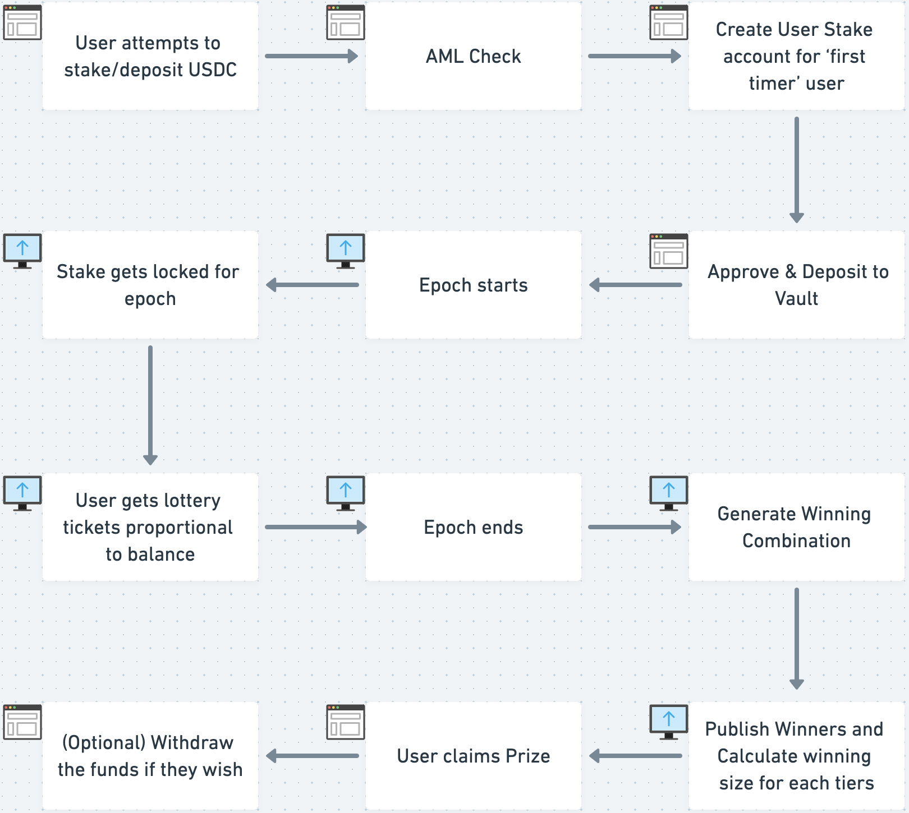

# Nezha

Nezha is a lossless game of staking.

## Requirements

 * [Docker](https://docs.docker.com/get-docker/)
 * [Docker Compose](https://docs.docker.com/compose/install/)
 * [Rust Stable 1.59+](https://rustup.rs/)

## Installation

Launch all the services the `api` is dependent on. An easy way to manage this is via docker. Environment variables control the connection between `api` and services.

```shell
# Setup services stack
docker-compose up -d
# Setup environment variables
export $(echo $(cat .env | sed 's/#.*//g' | sed 's/\r//g' | xargs) | envsubst)
# Build the api
cargo build
```
(Replace '.env' with '.env.devnet' in the second step if you want to work with the contract deployed to devnet)

## Usage

```shell
cargo run
```

Now you can connect your GraphQL client to `http://localhost:8080/`

To access the GraphQL playground, navigate with your favorite web browser to http://localhost:8080/

## Overall Flow


## Staking Contract Deployment to Solana
build: `cargo build-bpf`
deploy: `solana program deploy -u <cluster-name, e.g. devnet> ./target/deploy/staking.so`

## Try it out
You can try out a CLI based demo is split into two parts:
- Start here (follow the `New Contract Setup` section first for a newly deployed contract): [End user client demo](./client/demo)
- Then: [Contract crank demo](./backend/lottery/demo)

### 'USDC' FAUCET
To receive 1 million 'USDC' (`7tWUTDppUCLm482XrHqZK5mqChepjVdWw6xAkGXRBLeC`) for testing the contract in devent, do the below
```
cd client/demo
npm i
ts-node create_fake_usdc.ts <wallet_pubkey>
```
### Kubernetes deployment
1. Make sure your pipeline finished and your image was pushed
2. Restart the deployment to get the latest image:
   1. `kubectl -n lottery rollout restart deployment lottery`
   2. **NOTE:** if you don't have permissions to run `kubectl` command please ask your DevOps to give you permissions for that
